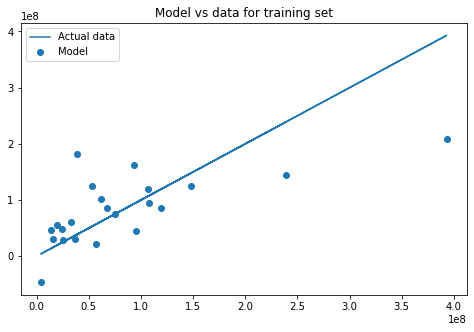

# Bias-Variance Trade-Off - Lab

## Introduction

In this lab, you'll practice your knowledge on the bias-variance trade-off!

## Objectives

You will be able to: 
- Look at an example where Polynomial regression leads to overfitting
- Understand how bias-variance trade-off relates to underfitting and overfitting

## Let's get started!

In this lab, you'll try to predict some movie revenues based on certain factors, such as ratings and movie year.


```python
import pandas as pd
from sklearn.preprocessing import MinMaxScaler

df = pd.read_excel('./movie_data_detailed_with_ols.xlsx')
df.head()
```


<div>
<style scoped>
    .dataframe tbody tr th:only-of-type {
        vertical-align: middle;
    }

    .dataframe tbody tr th {
        vertical-align: top;
    }

    .dataframe thead th {
        text-align: right;
    }
</style>
<table border="1" class="dataframe">
  <thead>
    <tr style="text-align: right;">
      <th></th>
      <th>budget</th>
      <th>domgross</th>
      <th>title</th>
      <th>Response_Json</th>
      <th>Year</th>
      <th>imdbRating</th>
      <th>Metascore</th>
      <th>imdbVotes</th>
      <th>Model</th>
    </tr>
  </thead>
  <tbody>
    <tr>
      <th>0</th>
      <td>13000000</td>
      <td>25682380</td>
      <td>21 &amp;amp; Over</td>
      <td>0</td>
      <td>2008</td>
      <td>6.8</td>
      <td>48</td>
      <td>206513</td>
      <td>4.912759e+07</td>
    </tr>
    <tr>
      <th>1</th>
      <td>45658735</td>
      <td>13414714</td>
      <td>Dredd 3D</td>
      <td>0</td>
      <td>2012</td>
      <td>0.0</td>
      <td>0</td>
      <td>0</td>
      <td>2.267265e+05</td>
    </tr>
    <tr>
      <th>2</th>
      <td>20000000</td>
      <td>53107035</td>
      <td>12 Years a Slave</td>
      <td>0</td>
      <td>2013</td>
      <td>8.1</td>
      <td>96</td>
      <td>537525</td>
      <td>1.626624e+08</td>
    </tr>
    <tr>
      <th>3</th>
      <td>61000000</td>
      <td>75612460</td>
      <td>2 Guns</td>
      <td>0</td>
      <td>2013</td>
      <td>6.7</td>
      <td>55</td>
      <td>173726</td>
      <td>7.723381e+07</td>
    </tr>
    <tr>
      <th>4</th>
      <td>40000000</td>
      <td>95020213</td>
      <td>42</td>
      <td>0</td>
      <td>2013</td>
      <td>7.5</td>
      <td>62</td>
      <td>74170</td>
      <td>4.151958e+07</td>
    </tr>
  </tbody>
</table>
</div>


```python
# Only keep four predictors and transform the with MinMaxScaler

scale = MinMaxScaler()
df = df[[ "domgross", "budget", "imdbRating", "Metascore", "imdbVotes"]]
transformed = scale.fit_transform(df)
pd_df = pd.DataFrame(transformed, columns = df.columns)
pd_df.head()
```


<div>
<style scoped>
    .dataframe tbody tr th:only-of-type {
        vertical-align: middle;
    }

    .dataframe tbody tr th {
        vertical-align: top;
    }

    .dataframe thead th {
        text-align: right;
    }
</style>
<table border="1" class="dataframe">
  <thead>
    <tr style="text-align: right;">
      <th></th>
      <th>domgross</th>
      <th>budget</th>
      <th>imdbRating</th>
      <th>Metascore</th>
      <th>imdbVotes</th>
    </tr>
  </thead>
  <tbody>
    <tr>
      <th>0</th>
      <td>0.055325</td>
      <td>0.034169</td>
      <td>0.839506</td>
      <td>0.500000</td>
      <td>0.384192</td>
    </tr>
    <tr>
      <th>1</th>
      <td>0.023779</td>
      <td>0.182956</td>
      <td>0.000000</td>
      <td>0.000000</td>
      <td>0.000000</td>
    </tr>
    <tr>
      <th>2</th>
      <td>0.125847</td>
      <td>0.066059</td>
      <td>1.000000</td>
      <td>1.000000</td>
      <td>1.000000</td>
    </tr>
    <tr>
      <th>3</th>
      <td>0.183719</td>
      <td>0.252847</td>
      <td>0.827160</td>
      <td>0.572917</td>
      <td>0.323196</td>
    </tr>
    <tr>
      <th>4</th>
      <td>0.233625</td>
      <td>0.157175</td>
      <td>0.925926</td>
      <td>0.645833</td>
      <td>0.137984</td>
    </tr>
  </tbody>
</table>
</div>


## Split the data into a test and train set


```python
# domgross is the outcome variable
X = pd_df[['budget','imdbRating','Metascore','imdbVotes']]
y = pd_df['domgross']
```


```python
#Your code here
from sklearn.model_selection import train_test_split
X_train , X_test, y_train, y_test = train_test_split(X, y)
```

## Fit a regression model to the training data and look at the coefficients


```python
# Your code 
from sklearn.linear_model import *
linreg = LinearRegression()
linreg.fit(X_train, y_train)
```


    LinearRegression(copy_X=True, fit_intercept=True, n_jobs=1, normalize=False)


```python
linreg.coef_
```


    array([ 0.47485436, -0.25744263,  0.25151536,  0.30856524])


## Plot the training predictions against the actual data (y_hat_train vs. y_train)

Let's plot our result for the train data. Because we have multiple predictors, we can not simply plot the income variable X on the x-axis and target y on the y-axis. Lets plot 
- A line showing the diagonal of y_train. The actual y_train values are on this line
- Next, make a scatter plot that takes the actual y_train on the x-axis and the predictions using the model on the y-axis. You will see points scattered around the line. The horizontal distances between the points and the lines are the errors.


```python
import matplotlib.pyplot as plt
%matplotlib inline
plt.figure(figsize=(8,5))
plt.scatter(y_train, linreg.predict(X_train), label='Model')
plt.plot(y_train, y_train, label='Actual Data')
plt.title('Model vs Data for Training Set')
plt.legend();
```


## Plot the test predictions against the actual data (y_hat_test vs. y_test)

Do the same thing for the test data.


```python
import matplotlib.pyplot as plt
%matplotlib inline
plt.figure(figsize=(8,5))
plt.scatter(y_test, linreg.predict(X_test), label='Model')
plt.plot(y_train, y_train, label='Actual Data')
plt.title('Model vs Data for Training Set')
plt.legend();
```





## Calculate the bias
Create a function `bias` to calculate the bias of a models predictions given the actual data: $Bias(\hat{f}(x)) = E[\hat{f}(x)-f(x)]$   
(The expected value can simply be taken as the mean or average value.)  


```python
import numpy as np
def bias(y, y_hat):
    return np.mean(y_hat - y)
```

## Calculate the variance
Create a function `variance` to calculate the variance of a model's predictions: $Var(\hat{f}(x)) = E[\hat{f}(x)^2] - \big(E[\hat{f}(x)]\big)^2$


```python
def variance(y_hat):
    return np.mean([yi**2 for yi in y_hat]) - np.mean(y_hat)**2
```

## Use your functions to calculate the bias and variance of your model. Do this separately for the train and test sets.


```python
# code for train set bias and variance

b = bias(y_train, linreg.predict(X_train)) 
v = variance(linreg.predict(X_train)) 
print('Bias: {} \nVariance: {}'.format(b,v))
```

    Bias: 2.901719268906659e-17 
    Variance: 0.027449331056376085


```python
# code for test set bias and variance

b = bias(y_test, linreg.predict(X_test)) 
v = variance(linreg.predict(X_test)) 
print('Bias: {} \nVariance: {}'.format(b,v))
```

    Bias: 0.05760433770819166 
    Variance: 0.009213684542614783


## Describe in words what these numbers can tell you.


```python
"""
These numbers indicate that the bias increases, but the variance
decreases. This indicates that the model is not overfitting, however
it might be overfitting.
"""
```

## Overfit a new model by creating additional features by raising current features to various powers.

Use `PolynomialFeatures` with degree 3. 

**Important note:** By including this, you don't only take polynomials of single variables, but you also combine variables, eg:

$ \text{Budget} * \text{MetaScore} ^ 2 $

What you're essentially doing is taking interactions and creating polynomials at the same time! Have a look at how many columns we get using `np.shape`. Quite a few!


```python
from sklearn.preprocessing import PolynomialFeatures
poly = PolynomialFeatures(3)

X_train_poly = poly.fit_transform(X_train)
X_test_poly = poly.fit_transform(X_test)
```


```python
np.shape(X_train_poly)
```


    (22, 35)


## Plot your overfitted model's training predictions against the actual data


```python
linreg = LinearRegression()
linreg.fit(X_train_poly, y_train)
plt.plot(y_train, y_train, label='Actual Data')
plt.scatter(y_train, linreg.predict(X_train_poly), label='Model')
plt.legend()
plt.title('Model vs Data for Training Set')
```


    Text(0.5,1,'Model vs Data for Training Set')


Wow, we almost get a perfect fit!

## Calculate the bias and variance for the train set


```python
b = bias(y_train, linreg.predict(X_train_poly)) #Your code here
v = variance(linreg.predict(X_train_poly)) #Your code here
print('Bias: {} \nVariance: {}'.format(b,v))
```

    Bias: -2.5421584029769207e-16 
    Variance: 0.07230707736656222


## Plot your overfitted model's test predictions against the actual data.


```python
plt.plot(y_train, y_train, label='Actual Data')
plt.scatter(y_test, linreg.predict(X_test_poly), label='Model')
plt.legend()
plt.title('Model vs Data for Training Set')
```


    Text(0.5,1,'Model vs Data for Training Set')


##  Calculate the bias and variance for the test set.


```python
b = bias(y_test, linreg.predict(X_test_poly)) #Your code here
v = variance(linreg.predict(X_test_poly)) #Your code here
print('Bias: {} \nVariance: {}'.format(b,v))
```

    Bias: -0.16998568902304564 
    Variance: 0.3596092440273582


## Describe what you notice about the bias and variance statistics for your overfit model


```python
# The bias and variance for the test set both increased drastically in the overfit model.
```

## Level Up - Optional

In this lab we went from 4 predictors to 35 by adding polynomials and interactions, using `PolynomialFeatures`. That being said, where 35 leads to overfitting, there are probably ways to improve by just adding a few polynomials. Feel free to experiment and see how bias and variance improve!

## Summary

This lab gave you insight into how bias and variance change for a training and a test set by using a pretty "simple" model, and a very complex model. 
